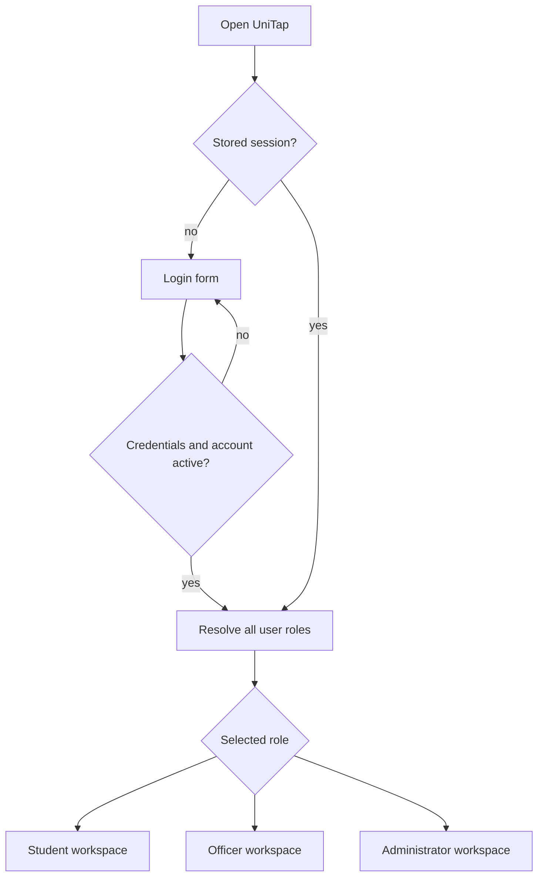

# User Flows

## Login and role resolution

```mermaid
flowchart TD
  A[Open UniTap] --> B{Stored session?}
  B -- no --> C[Login form]
  C --> D{Credentials and account active?}
  D -- no --> C
  D -- yes --> E[Resolve all user roles]
  B -- yes --> E
  E --> F{Selected role}
  F --> G[Student workspace]
  F --> H[Officer workspace]
  F --> I[Administrator workspace]
```

Students can view their own current record and historical assignments. Administrators manage the temporary academic records and simulated devices.